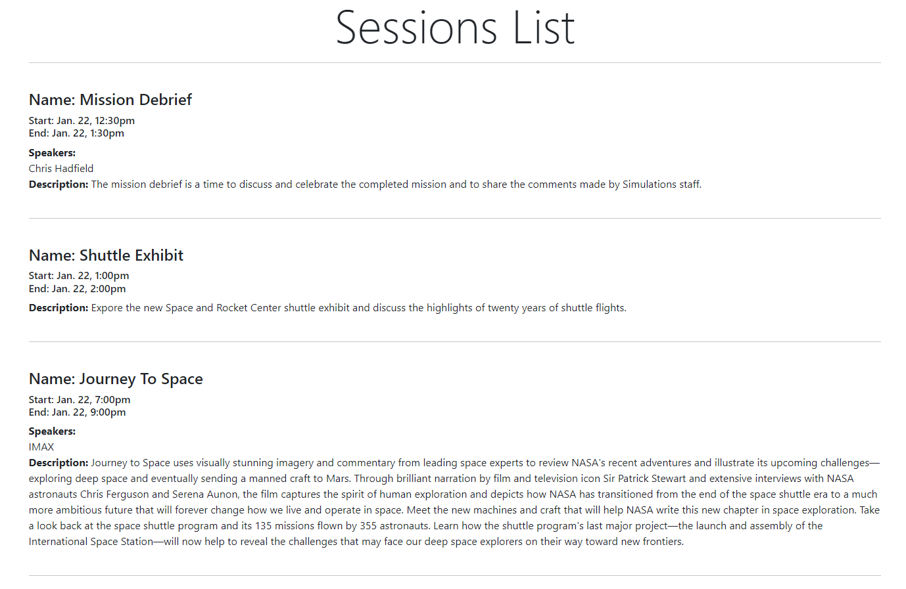

# Solution Setup

A short guide to running my solution. 

### Tools Needed:
- [MySQL 8.0](https://downloads.mysql.com/archives/get/p/25/file/mysql-installer-web-community-8.0.19.0.msi)
- [MySQLi (PHP Extension)](https://www.php.net/manual/en/mysqli.installation.php)
- [PHP 8.2.9](https://www.php.net/manual/en/install.php)

### Description

Based off the directions from the ReadMe, the goal of this solution is that data be pulled from the three tables in the database then organized in following fashion:

1. Each unique session is displayed to the page as a list which is organized according to start time  where the earliest session is displayed first. 
2. For each session, the list of speakers is organized alphabetically by last name. When a last name doesn't exist the first name is used. When multiple users have the same last name, then that group of users is organized alphabetically by their first name. 
3. Each session shows a name, start time, end time, list of speakers, and a description of the event. 
4. Only active sessions are shown.
5. Only users with the role of speaker are listed in the speaker section.

### Pull Project from Github

1. Open a new terminal.
2. Navigate to whichever directory is preferred to store this project.
3. Run the following command: 
```$ git clone ``` to clone this project locally.

### Database Setup
1. Within MySQL Workbench, connect to your local instance and create a new database schema for this project. 
2. execute the SQL files found in `codechallenge/data` within the new schema to populate the database with the test data. Verify in Workbench that there are now three tables filled with dummy data:
    - role
    - session
    - user
3. navigate to `codechallenge/constants` and open the `mysql-vals.php` file in a preferred code editor. 
4. Within the file, update the string values of the following variables. These are used to connect to your local database:
    - `$username` on line 2 (for most people this value will be `root`).
    - `$password` on line 3 (this is the password associated with your sql root user).
    - `$schema` on line 4 (the name of the new schema created in the first step). 

### Launch The Server

Navigate to the root directory of the project and run the following command from your terminal:

```
$ php -S localhost:4001 
```
Verify that something similar to the following should is visible in the terminal: 
```
[Thu Aug  3 10:36:25 2023] PHP 8.2.9 Development Server (http://localhost:4001) started
```
Open a new tab in the browser and naviagate to `http://localhost:4001/home.php`. The following webpage should be visible:

